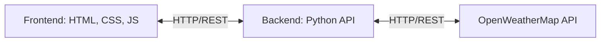

# Technical Design Document (TDD): Weather Web Application

## 1. System Overview
This document outlines the technical architecture and design for the Weather Web Application. The system is designed to be lightweight, fast, and highly responsive. It adopts a decoupled client-server architecture where the frontend handles presentation and user interaction, while a lightweight Python backend serves as an API gateway to the external OpenWeatherMap API.

## 2. Architecture Diagram

## 3. Technology Stack

### 3.1. Frontend
- **HTML5:** Semantic structure for the web pages.
- **CSS3:** Vanilla CSS for styling. Focus on responsive design (Flexbox/Grid), glassmorphism effects, and CSS animations for weather states.
- **JavaScript (Vanilla JS):** Core logic for DOM manipulation, event handling, and making asynchronous API calls (using `fetch`). No heavy frameworks (like React/Vue) will be used to keep the bundle size minimal.

### 3.2. Backend
- **Language:** Python 3.x
- **Framework:** FastAPI or Flask (Recommended: FastAPI for high performance and modern API standards).
- **Role:** The backend will act as a secure proxy server. It receives requests from the frontend, securely attaches the OpenWeatherMap API key (keeping it hidden from the client), forwards the request to OpenWeatherMap, and returns the formatted data to the frontend.

### 3.3. External APIs
- **Weather API:** OpenWeatherMap API (Current Weather Data and Forecast API).

### 3.4. Database
- **No Database:** As per requirements (`tidak membutuhkan database`), the application is completely stateless. No user data, session history, or cached weather data is stored persistently on the server.

## 4. Frontend Component Design

### 4.1. User Interface Structure
- **Header:** Contains the application title/logo and a search bar with a submit button.
- **Main Content Area:**
  - **Current Weather Card:** Displays the primary location, current temperature, large weather icon, and a short description (e.g., "Partly Cloudy").
  - **Weather Details Grid:** Smaller cards showing secondary metrics: Humidity, Wind Speed, UV Index, and Pressure.
  - **Forecast Section:** A horizontal scrollable list or grid displaying the upcoming multi-day forecast.

### 4.2. Styling & Aesthetics (UI/UX)
- **Theme:** Dynamic background that changes based on the time of day (day/night) and current weather conditions (clear, rain, snow, cloudy).
- **Effects:** Heavy use of Glassmorphism (semi-transparent backgrounds with `backdrop-filter: blur`) to ensure text readability over dynamic background images or gradients.
- **Responsiveness:** Mobile-first approach. The layout will seamlessly adapt from a single-column view on mobile devices to a multi-column dashboard on larger desktop screens.

## 5. API Endpoints (Python Backend)

The Python backend will expose the following RESTful endpoints for the frontend to consume:

### `GET /api/weather/current?city={city_name}`
- **Description:** Fetches current weather data for a specific city.
- **Process:** Backend receives the request, calls OpenWeatherMap `weather` endpoint, and returns the JSON.

### `GET /api/weather/forecast?city={city_name}`
- **Description:** Fetches the upcoming weather forecast.
- **Process:** Backend receives the request, calls OpenWeatherMap `forecast` endpoint, and returns the JSON.

### `GET /api/weather/coords?lat={latitude}&lon={longitude}`
- **Description:** Fetches current weather and forecast based on geolocation coordinates.
- **Process:** Used when the user grants the browser location access.

## 6. Data Flow & Security
1. **User Action:** User searches for a city or grants location access.
2. **Client Request:** JavaScript `fetch()` calls the Python backend API (e.g., `/api/weather/current?city=London`).
3. **Server Proxy:** Python backend appends the secret OpenWeatherMap API Key to the request.
4. **External API Call:** Python backend makes the request to OpenWeatherMap.
5. **Response:** OpenWeatherMap returns data to the Python backend.
6. **Client Update:** Python backend forwards the JSON to the frontend, and JavaScript dynamically updates the DOM elements.

**Security Consideration:** The OpenWeatherMap API key MUST be stored in a `.env` file on the backend server and never exposed in the frontend HTML/JS code.

## 7. Error Handling
- **Frontend:** Display user-friendly error UI states (e.g., "City not found," "Location access denied," "Unable to fetch weather data") instead of crashing.
- **Backend:** Catch external API errors (e.g., 404 Not Found, 401 Unauthorized) and forward standardized HTTP error codes and JSON error messages to the frontend.
